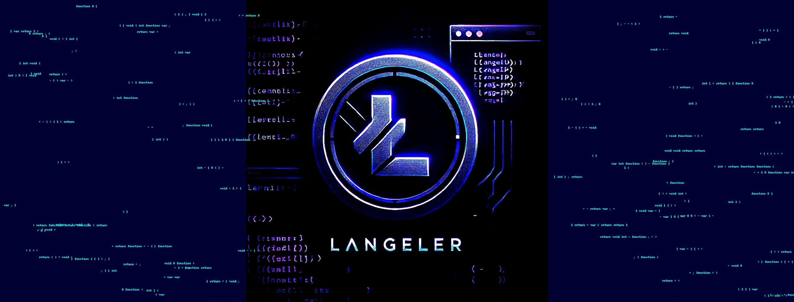

# LangelerMVC Framework

[](https://www.php.net/)
**A PHP 7.4 / 8+ MVC Framework focusing on structure, adhering to the Single Responsibility Principle (SRP), Separation of Concerns (SoC), and Object-Oriented Programming (OOP)**.

---

## Table of Contents

- [Project Overview](#project-overview)
- [Features](#features)
- [Installation](#installation)
- [Directory Structure](#directory-structure)
  - [Complete Directory Breakdown](#complete-directory-breakdown)
- [Configuration](#configuration)
- [Usage](#usage)
- [Development Status](#development-status)
- [Testing](#testing)
- [Contributing](#contributing)
- [Support](#support)
- [License](#license)

---

## Project Overview

LangelerMVC is a custom-built PHP MVC framework designed to provide a highly structured and modular approach to building web applications. The framework adheres to important design principles such as:

- **Single Responsibility Principle (SRP)**: Ensuring each class is responsible for only one part of the functionality.
- **Separation of Concerns (SoC)**: Encouraging separation between distinct functionalities to enhance maintainability.
- **Object-Oriented Programming (OOP)**: Utilizing OOP practices like inheritance, encapsulation, and polymorphism.

This framework is ideal for developers who want a solid foundation for building scalable PHP applications using modern best practices.

---

## Features

- **MVC Architecture** (Model-View-Controller)
- **PHP 7.4+ Support**
- **Modular Design** with Admin and User Modules
- **SQL Integration** with MySQL using PDO
- **Custom Templating System** with Layouts, Pages, Partials, and Components
- **Security Features** like 2FA (Two-Factor Authentication) and secure email verification
- **Localization Support** including locale management and number formatting
- **Detailed Error and Exception Handling**
- **PSR-4 Autoloading**
- **Mailer Integration** (SMTP)
- **Shell Command Execution**, Stream Handling, and Sockets
- **Custom Validators and Sanitizers**
- **Unit and Integration Testing with PHPUnit**

---

## Installation

### Prerequisites

- PHP 7.4 or PHP 8.0+
- MySQL Database
- Composer

### Steps

1. Clone the repository:

	```bash
	git clone https://github.com/langeler/LangelerMVC.git
	cd LangelerMVC
	```

2. Install the dependencies:

	```bash
	composer install
	```

3. Copy the example environment file and update settings:

	```bash
	cp .env.example .env
	```

4. Set up your `.env` configuration file:

	```ini
	APP_NAME="Langeler"
	APP_ENV=local
	APP_DEBUG=true
	APP_URL=http://localhost
	DB_CONNECTION=mysql
	DB_HOST=127.0.0.1
	DB_PORT=3306
	DB_DATABASE=langeler
	DB_USERNAME=root
	DB_PASSWORD=root
	```

5. Set up your database:

	```bash
	php artisan migrate
	```

6. Run the application:

	```bash
	php -S localhost:8000 -t Public/
	```

---

## Directory Structure

LangelerMVC is designed with modularity in mind, making it easier to maintain and scale the application. Below is a complete breakdown of the core directory structure with detailed explanations of each subfolder.

### Complete Directory Breakdown

```
LangelerMVC/
├── App/                        # Core application code
│   ├── Abstracts/              # Abstract classes for common functionality
│   ├── Contracts/              # Interface contracts for dependency injection
│   ├── Core/                   # Core framework logic, including bootstrap and initial loaders
│   ├── Database/               # Database layer, including migrations, models, repositories, seeds
│   │   ├── Migrations/         # Database migrations
│   │   ├── Models/             # Eloquent models or custom database models
│   │   ├── Repositories/       # Data access layers (Repository pattern)
│   │   ├── Seeds/              # Database seeders
│   ├── Exceptions/             # Custom exception classes for error handling
│   ├── Helpers/                # Utility helper classes for common operations
│   ├── Modules/                # Application modules, including Admin and User Modules
│   │   ├── AdminModule/        # Admin-specific logic and components
│   │   │   ├── Controllers/    # Admin controllers for handling requests
│   │   │   ├── Middlewares/    # Admin-specific middlewares for security and other purposes
│   │   │   ├── Requests/       # Request validation logic for Admin routes
│   │   │   ├── Responses/      # Response handling for Admin routes
│   │   │   ├── Routes/         # Admin route definitions
│   │   │   ├── Views/          # Views/templates related to the Admin panel
│   │   ├── UserModule/         # Similar to AdminModule, but for user-facing logic
│   ├── Presenters/             # Data presentation layer (e.g., formatting data for views)
│   ├── Resources/              # Static resources (CSS, JS, Images)
│   │   ├── css/                # Custom stylesheets
│   │   ├── images/             # Image files
│   │   ├── js/                 # Custom JavaScript files
│   ├── Services/               # Service layer for handling complex operations
│   ├── Templates/              # Template files (layouts, components, partials, pages)
│   │   ├── Components/         # Reusable view components (e.g., buttons, modals)
│   │   ├── Layouts/            # Page layouts (e.g., header, footer)
│   │   ├── Pages/              # Individual page views
│   │   ├── Partials/           # Smaller reusable parts of pages (e.g., navigation)
│   ├── Utilities/              # Utility classes for additional functionalities
│       ├── Sanitation/         # Data sanitation methods and tools
│       ├── Validation/         # Custom validation logic and rules
├── Config/                     # Configuration files for different aspects of the application
│   ├── app.php                 # Application-specific configuration
│   ├── database.php            # Database connection configuration
│   ├── feature.php             # Feature toggles and settings
│   ├── mail.php                # Mail configuration settings
├── Data/                       # SQL data dumps and seed files
│   ├── Carts.sql               # Example SQL dump for carts table
│   ├── Orders.sql              # Example SQL dump for orders table
│   ├── Products.sql            # Example SQL dump for products table
│   ├── Users.sql               # Example SQL dump for users table
├── Public/                     # Public-facing files and assets
│   ├── assets/                 # Frontend assets (CSS, JS, Images)
│   │   ├── css/                # Compiled and minified CSS
│   │   ├── images/             # Public images for the web app
│   │   ├── js/                 # Compiled and minified JS
│   ├── .htaccess               # URL rewriting and security rules
│   ├── index.php               # Main entry point for the application
├── Storage/                    # Storage for logs, cache, and uploaded files
│   ├── Cache/                  # Cache files for performance improvements
│   ├── Logs/                   # Log files for debugging
│   ├── Uploads/                # Uploaded user files
├── Tests/                      # Unit and Integration test suites
│   ├── Integration/            # Integration tests for testing multiple parts together
│   ├── Unit/                   # Unit tests for isolated testing of components
├── Vendor/                     # Composer dependencies
├── .env                        # Application environment variables
├── .env.example                # Example environment configuration file
├── .gitignore                  # Git ignore file
├── composer.json               # Composer configuration for dependencies and autoloading
├── composer.lock               # Composer lock file
└── README.md                   # Project documentation
```

---

## Configuration

### `.env` Example:

```ini
APP_NAME="Langeler"
APP_ENV=local
APP_DEBUG=true
APP_URL=http://localhost
DB_CONNECTION=mysql
DB_HOST=127.0.0.1
DB_PORT=3306
DB_DATABASE=langeler
DB_USERNAME=root
DB_PASSWORD=root
```

**Mail Configuration**:

```ini
MAIL_DRIVER=smtp
MAIL_HOST=smtp.langeler.se
MAIL_PORT=587
MAIL_USERNAME=noreply@langeler.se
MAIL_PASSWORD=secret
MAIL_ENCRYPTION=tls
```

---

## Usage

### URL Rewriting and Security

LangelerMVC uses a `.htaccess` file for clean URL rewriting and security headers:

- Redirect all requests to `index.php`
- Deny access to sensitive files like `.htaccess`, `.env`, and Composer files
- Add security headers for protection against MIME sniffing, XSS, and Clickjacking

### Shell and Stream Handling

The framework includes handlers for shell commands and stream management, making it easy to execute commands and manage file streams and sockets securely.

---

## Development Status

### **Under Active Development**

LangelerMVC is currently under active development, and several key features are still being implemented or refined. Below is a list of features currently being developed or improved:

- **Advanced Routing**: Additional support for RESTful routes and route groups.
- **Admin Dashboard Enhancements**: More features and UI improvements for the admin panel.
- **User Module Improvements**: Better user profile management, enhanced security, and user activity logging.
- **More Built-in Validators**: Including more built-in rules and support for custom validation logic.
- **Localization**: Improvements in multilingual support and content translation.
- **Enhanced Security Features**: Additional security layers, such as role-based access control (RBAC), and security auditing tools.
- **Performance Optimizations**: Optimizing SQL queries, caching, and memory usage for better performance.

Stay tuned for upcoming features and releases!

---

## Testing

LangelerMVC supports unit and integration testing with **PHPUnit**.

To run the tests:

```bash
composer test
```

Tests are located in the `Tests/` directory, separated into **Unit** and **Integration** tests.

---

## Contributing

Contributions are highly encouraged and welcome!

1. **Fork** the repository.
2. **Create a feature branch**: `git checkout -b my-feature`.
3. **Commit your changes**: `git commit -m 'Add a feature'`.
4. **Push to the branch**: `git push origin my-feature`.
5. **Open a Pull Request**.

---

## Support

For any issues, suggestions, or feature requests, feel free to:

- Open an [Issue on GitHub](https://github.com/langeler/LangelerMVC/issues).
- Contribute to the [LangelerMVC Wiki](https://github.com/langeler/LangelerMVC/wiki).

---

## License

This project is licensed under the MIT License. See the [LICENSE](https://github.com/langeler/LangelerMVC/blob/main/LICENSE) file for details.

---

## GitHub Links

- **Developer GitHub**: [https://github.com/langeler](https://github.com/langeler)
- **Project GitHub**: [https://github.com/langeler/LangelerMVC](https://github.com/langeler/LangelerMVC)
