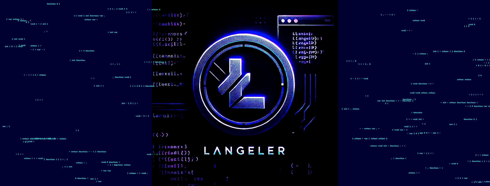

# LangelerMVC

[](https://www.php.net/)

LangelerMVC is a custom-built PHP MVC framework designed with a strong focus on structure, modularity, and best practices, including SRP, SoC, and OOP principles.

## Verification Snapshot

As of `2026-04-10`:

- Verified on PHP `8.4.12`
- `composer test` passes with `OK (64 tests, 1839 assertions)`
- Core runtime, cache, crypto, query, validation, MVC, console, schema lifecycle, session driver, and utility subsystems are implemented
- `WebModule` is the first completed application slice
- Remaining business modules are scaffolded, not implemented yet

## Current State

- The framework backend is no longer just scaffolding. Bootstrap, runtime, container, config, routing, session, validation, sanitization, cache, crypto, SQL/query, file/finder/iterator/reflection, and persistence foundations are implemented and regression-tested.
- The framework now includes a first-party operational console, module-aware migration/seed runners, resource-based JSON response support, first-party file/database/redis session drivers, and framework-native mail/OTP service boundaries.
- `WebModule` is the first concrete module and demonstrates the intended request-to-response pipeline through request, controller, service, presenter, view, response, model, repository, route, and shared templates.
- `WebModule` now also includes framework-managed `pages` migration and seed classes, so the starter module can move from memory-backed content to database-backed content without bypassing the framework lifecycle.
- `AdminModule`, `CartModule`, `OrderModule`, `ShopModule`, and `UserModule` are intentionally scaffolded to make the intended architecture visible, but they still need real implementation.
- Mail/OTP-related Composer dependencies are now behind framework-native manager abstractions, but identity, RBAC, and notification workflows still need to be built on top of them.

## Design Goals

- Extendability through contracts, abstract base classes, providers, and modular application boundaries.
- Maintainability through SRP, SoC, and focused responsibilities in the core runtime and module layers.
- Readability through explicit folder boundaries, typed abstractions, and framework-level regression coverage.
- Security through a thin public entrypoint, environment-aware bootstrap, configuration isolation, session hardening, and a safer Apache public config.
- Performance through lazy service resolution, config caching in memory, route caching, and a clear separation between public assets and application resources.
- Organization through a predictable `App/` layout and module-first backend architecture.

## Request Lifecycle

The current HTTP flow is:

1. `Public/index.php` boots the application through `bootstrap/app.php`.
2. `App\Core\Bootstrap` registers framework paths, applies runtime defaults, loads `.env`, and creates the application.
3. `App\Core\App` boots the framework, resolves config and router services, applies runtime policy, and dispatches the request.
4. `App\Core\Router` loads module route files and dispatches the matched controller action.
5. Concrete module classes handle the request through the framework pipeline.

In the current starter slice, `WebModule` follows:

`WebRequest -> HomeController -> PageService -> PagePresenter -> WebView -> WebResponse`

## Architecture Overview

### `App/`

- `Abstracts/`: reusable framework base classes for data, database, HTTP, and presentation concerns.
- `Contracts/`: interface surface for the abstractions and core layer, including console, presentation resource, session, and support contracts.
- `Core/`: framework runtime services such as `App`, `Bootstrap`, `Config`, `Container`, `Database`, `MigrationRunner`, `Router`, `SeedRunner`, and `Session`.
- `Drivers/`: low-level pluggable adapters. Caching, cryptography, and session drivers are present.
- `Exceptions/`: typed framework exception classes grouped by concern.
- `Modules/`: application modules. `WebModule` is implemented; the other modules are scaffolded.
- `Providers/`: container/provider wiring for core, cache, crypto, exceptions, and modules.
- `Resources/`: source asset placeholders that belong to the application layer.
- `Templates/`: shared PHP template files used by module views.
- `Utilities/`: shared traits, handlers, managers, finders, query helpers, validators, sanitizers, and support managers such as mail/OTP.

### Other Root Folders

- `Config/`: runtime configuration arrays loaded by the config facade and merged with `.env` overrides at runtime.
- `Data/`: standalone SQL reference files kept as reference material beside the framework-managed migration system.
- `Docs/`: current architecture and structure docs, plus older reference materials kept in the repository.
- `Public/`: the public document root, front controller, Apache config, and public asset folders.
- `console`: the first-party CLI entrypoint for operational framework commands.
- `Services/`: reserved for cross-application service composition outside a specific module.
- `Storage/`: cache, logs, secure keys, sessions, and uploads.
- `Tests/`: framework regression coverage plus scaffolded `Unit` and `Integration` suites.
- `autoload.php`: legacy fallback autoload helper. The primary bootstrap path uses Composer through `bootstrap/app.php`.

For a deeper architecture walkthrough, see [`Docs/ArchitectureOverview.md`](./Docs/ArchitectureOverview.md).

## Installation

### Requirements

- PHP 8.4+
- Composer

### Setup

```bash
git clone https://github.com/langeler/LangelerMVC.git
cd LangelerMVC
composer install
cp .env.example .env
```

Adjust `.env` values as needed for your environment. The framework can boot without a live database connection, but database-backed modules will of course require valid DB settings.

## Running The Project

### Built-in PHP Server

```bash
php -S 127.0.0.1:8000 -t Public Public/index.php
```

### Apache

Point the document root at `Public/` and use [`Public/.htaccess`](./Public/.htaccess) for front-controller routing and baseline public protections.

### Framework Console

```bash
php console list
php console migrate
php console seed WebModule
php console route:list
```

## Configuration Notes

- `.env` provides environment-specific overrides.
- `Config/*.php` files provide the tracked runtime configuration surface.
- `Config/auth.php` contains the initial framework auth/OTP baseline settings.
- `Config/webmodule.php` controls the current `WebModule` content source.
  - `CONTENT_SOURCE=memory` keeps the starter module self-contained.
  - `CONTENT_SOURCE=database` enables repository-backed loading once the `pages` migration and seed have been run.
- Session drivers support `native`, `file`, `database`, and `redis`, with `native` remaining the tracked default.
- Session files are stored in `Storage/Sessions` by default when using the native/files-backed modes.

## Testing

Run the current regression suite with:

```bash
composer test
```

The active framework tests live in `Tests/Framework`. `Tests/Unit` and `Tests/Integration` are intentionally present as scaffolded suites for future growth.

## Structure Docs

- [`Docs/README.md`](./Docs/README.md): documentation index and reading order.
- [`Docs/ArchitectureOverview.md`](./Docs/ArchitectureOverview.md): framework architecture, runtime flow, subsystem map, and extension points.
- [`Docs/FrameworkStatus.md`](./Docs/FrameworkStatus.md): current implementation status, missing areas, and recommended next build order.
- [`Docs/FolderStructure.md`](./Docs/FolderStructure.md): current architecture by layer and responsibility.
- [`Docs/ModulesStructure.md`](./Docs/ModulesStructure.md): module layout, conventions, and current module status.
- [`Docs/CompleteStructure.md`](./Docs/CompleteStructure.md): full current repository tree, excluding `.git` and `vendor`.
- [`Docs/SanitationValidationAPI.md`](./Docs/SanitationValidationAPI.md): schema contract for sanitizers and validators.
- [`Docs/UtilitiesTraitsOverview.md`](./Docs/UtilitiesTraitsOverview.md): practical overview of the trait surface.
- [`Docs/UtilitiesTraitsReference.md`](./Docs/UtilitiesTraitsReference.md): generated trait reference.

## Development Status

LangelerMVC now has a strong backend foundation and a real starter module. The next highest-value work is:

1. Implement `UserModule` on top of the new console/schema/session/mail/OTP platform layer.
2. Build framework-native session authentication, password reset, email verification, and RBAC services.
3. Extend `AdminModule` into the management surface for users, roles, permissions, and framework inspection.
4. Continue into `ShopModule`, `CartModule`, and `OrderModule`.
5. Add event, notification, and queue subsystems after the core business modules are in place.

## Support

- Issues: [github.com/langeler/LangelerMVC/issues](https://github.com/langeler/LangelerMVC/issues)
- Source: [github.com/langeler/LangelerMVC](https://github.com/langeler/LangelerMVC)
- Wiki: [github.com/langeler/LangelerMVC/wiki](https://github.com/langeler/LangelerMVC/wiki)

## License

This project is licensed under the MIT License.
